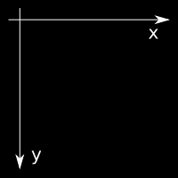
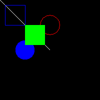

Funciones
=========

MiniWin es *super*-simple: sólo es un miniconjunto de funciones. Para
usar MiniWin solamente hay que seguir 2 pasos importantes:

- Poner arriba del programa principal::

    #include "miniwin.h"
    using namespace miniwin;

  Fíjate en que hay comillas dobles y no ángulos alrededor de
  ``miniwin.h`` en el ``#include``. El ``using namespace miniwin`` te
  será familiar por su equivalente con ``std``.

- Hacer la función ``main`` así::

     int main() {
       return 0;
     }

  Es decir, sin parámetros y devolviendo ``int``. El ``return 0`` es
  obligatorio.

Aparte de eso se trata de utilizar las funciones que se comentan a
continuación.

Control de la ventana
---------------------

En MiniWin, al ejecutar el programa principal siempre se creará una
sola ventana, a la que nos referiremos como "la ventana". Esta ventana
no se puede redimensionar con el ratón (solamente con la acción
:cpp:func:`vredimensiona`) y mantiene el dibujo que pintas aunque la
minimices.  Algunas funciones utilizan coordenadas en esta
ventana. Las coordenadas son un par ordenado de valores, donde el
primer valor es *x* y el segundo es *y*:

- La esquina superior-izquierda es el orígen, con coordenadas (0,0).

- A medida que nos desplazamos a la derecha la coordenada *x* crece.

- A medida que nos desplazamos hacia abajo la coordenada *y* crece.

El diagrama sería el siguiente:

Hay 3 funciones relacionadas con las dimensiones de la ventana.

.. cpp:function:: void vredimensiona(int ancho, int alto)

   Acción que cambia las dimensiones (en píxeles) de la ventana. El
   primer parámetro indica la anchura y el segundo la altura, ambos
   son enteros. Por ejemplo::

      vredimensiona(800, 600);

   cambiará las dimensiones de la ventana a 800 por 600 píxeles.  El
   hecho de redimensionar la ventana implica que ésta se borrará, como
   si hiciésemos :cpp:func:`borra` justo después del
   :cpp:func:`vredimensiona`.

.. cpp:function:: int vancho()

   Función que averigua el ancho de la ventana en píxeles, devolviendo
   un entero.  Por ejemplo, el siguiente código utiliza la función
   :cpp:func:`vancho`::

      int a = vancho();
      if (a > 500) {
        cout << "El ancho de la ventana es mayor que 500" << endl;
      }

.. cpp:function:: int valto()

   Función que averigua la altura de la ventana en píxeles,
   devolviendo un entero. Es similar a :cpp:func:`vancho`.

.. cpp:function:: void vcierra()

   Acción que cierra la ventana y termina el programa.  Si no se llama
   esta acción, cuando acaba la función ``main`` la ventana se queda
   abierta mostrando el dibujo que hayamos hecho, y hay que cerrarla
   manualmente. Esto nos puede interesar para observar el dibujo que
   hayamos hecho.

Pintar en la ventana
--------------------

Para pintar en la ventana hay que utilizar alguna de las acciones
:cpp:func:`linea`, :cpp:func:`rectangulo`, :cpp:func:`circulo`, etc.
y luego hay que invocar la acción :cpp:func:`refresca`. Esencialmente,
todo lo que se pinta se acumula en un "buffer" y luego la acción
:cpp:func:`refresca` hace visible en la ventana lo que se haya pintado
previamente. Esto tiene una ventaja y un inconveniente. La ventaja es
que permite pintar muchas cosas y luego refrescar solo una vez, que es
importante cuando se hacen juegos. El inconveniente es que si se
olvida la llamada a :cpp:func:`refresca`, entonces no aparece por
pantalla nada de lo que se ha pintado y puede parecer que no funciona
nuestro programa. En definitiva, es importante *recordar llamar a
:cpp:func:`refresca` al acabar de pintar*.

Para cambiar el color con el que se pinta, hay que llamar a la función
:cpp:func:`color` antes de pintar, es decir, todo lo que se pinta
después de la instrucción::

  color(ROJO);

saldrá en color rojo.

Por ejemplo, el siguiente programa

.. literalinclude:: _src/ex1.cpp

muestra el siguiente dibujo:

En MiniWin disponemos de las siguiente acciones para pintar objetos:

.. cpp:function:: void punto(float x, float y)

   Pinta un solo punto de la pantalla, en la posición (*x*, *y*). En
   función de la resolución de la pantalla esto puede costar un poco
   de ver.

   Por ejemplo::

      color(AMARILLO);
      punto(10, 10);
      punto(9, 10);
      punto(10, 9);
      punto(10, 11);
      punto(11, 10);
      refresca();

   pinta una minicruz centrada en la posición (10, 10).

.. cpp:function:: void linea(float x_ini, float y_ini, float x_fin, float y_fin)

   Dibuja una línea desde el punto (*izq*, *arr*), o sea
   *izquierda-arriba* hasta el punto (*der*, *aba*) o sea,
   *derecha-abajo*.

   Dos líneas paralelas son, por ejemplo::

      linea(0,  0, 100,  0);
      linea(0, 10, 100, 10);

.. cpp:function:: void rectangulo(float izq, float arr, float der, float aba)

   Dibuja el borde de un rectángulo con coordenadas horizontales (las
   *x*) *izq* y *der* y verticales (las *y*) *arr* y *aba*.

.. cpp:function:: void rectangulo_lleno(float izq, float arr, float der, float aba)

   Dibuja un rectángulo relleno con coordenadas horizontales (las
   *x*) *izq* y *der* y verticales (las *y*) *arr* y *aba*.

.. cpp:function:: void circulo(float x_cen, float y_cen, float radio)

   Dibuja una circumferencia con el centro en (*x_cen*, *y_cen*) y con un
   cierto *radio*. Si llamamos::

      circulo(50, 100, 20);

   Aparecerá un círculo de radio 20 con centro en el punto (50, 100)

.. cpp:function:: void circulo_lleno(float x_cen, float y_cen, float radi)

   Dibuja un círculo (relleno) con el centro en (*x_cen*, *y_cen*) y
   con un cierto *radio*.

.. cpp:function:: void texto(float x, float y, const std::string& texto)

   Pinta un texto a partir de la posición (*x*, *y*) con el contenido
   del parámetro *texto*.

Para cambiar el color tenemos las 2 acciones siguientes:

.. cpp:function:: void color(int c)

   Cambia el color a partir de un número entre 0 y 7 ambos
   incluidos. MiniWin define las siguientes 8 constantes para no tener
   que recordar a qué color corresponde cada número: ``NEGRO``,
   ``ROJO``, ``VERDE``, ``AZUL``, ``AMARILLO``, ``MAGENTA``, ``CYAN``
   y ``BLANCO``.

.. cpp:function:: void color_rgb(int r, int g, int b)

   Cambia el color a un valor RGB arbitrario. Los valores de los
   parámetros *r*, *g* y *b* deben estar entre 0 y 255 ambos
   incluidos. Por ejemplo::

      color_rgb(128, 0, 0);

   selecciona un color rojo apagado.

Después de llamar a las funciones para pintar objetos, es muy
importante llamar a la acción :cpp:func:`refresca`:

.. cpp:function:: void refresca()

   Pone en la ventana todo los objetos pintados acumulados. Muy
   importante llamar a esta acción después de pintar. Por ejemplo,
   para pintar una línea (que se añade a todo lo anterior::

     linea(0, 0, 100, 100);
     refresca();

.. cpp:function:: void borra()

   Borra el "buffer" interno de pintado. Todo lo que se pinte después
   se pintará sobre un fondo negro, como al principio. Para borrar la
   pantalla y dejarla negra, habría que llamar a :cpp:func:`refresca`
   después de llamar a :cpp:func:`borra`. O sea, para borrar la
   pantalla completamente y hacerlo visible::

     borra();
     refresca();

Funciones para teclas
---------------------

En MiniWin se puede determinar si el usuario acaba de presionar una
tecla (o hace un rato), con la función :cpp:func:`tecla`. Esta función
no espera a que el usuario presione una tecla ya que esto
interrumpiría el programa totalmente. Por eso uno de los valores que
puede devolver :cpp:func:`tecla` es el valor ``NINGUNA`` para indicar
que el usuario no ha presionado una tecla recientemente. Las teclas
que se presionan se guardan en un *buffer* y cada llamada a
:cpp:func:`tecla` las retorna una por una.

.. cpp:function:: int tecla()

   Devuelve un entero para indicar si se acaba de presionar una
   tecla. Si se han presionado varias, se puede llamar a
   :cpp:func:`tecla` varias veces y se irán obteniendo las teclas
   presionadas por orden.

   Si no se ha presionado ninguna tecla, se devuelve la constante
   ``NINGUNA``

   Para evitar tener que recordar qué enteros representan a cada
   tecla, MiniWin define las siguientes constantes:

   ================== ============================
   Tecla              Constante
   ================== ============================
   Ninguna tecla      ``NINGUNA``
   ------------------ ----------------------------
   Esc                ``ESCAPE``
   ------------------ ----------------------------
   Barra espaciadora  ``ESPACIO``
   ------------------ ----------------------------
   Return             ``RETURN``
   ------------------ ----------------------------
   Flecha Arriba      ``ARRIBA``
   ------------------ ----------------------------
   Flecha Abajo       ``ABAJO``
   ------------------ ----------------------------
   Flecha Derecha     ``DERECHA``
   ------------------ ----------------------------
   Flecha Izquierda   ``IZQUIERDA``
   ------------------ ----------------------------
   Teclas de Función  ``F1``, ``F2`` hasta ``F10``
   ================== ============================

   Para las letras y los números, el código devuelto es el mismo
   código ASCII. Para los números entre 48 y 57 y para las letras
   entre 65 y 90 (las mayúsculas).

   El siguiente ejemplo detecta la presión de una tecla y si es la
   letra ``A`` se muestra un mensaje::

      int t = tecla();
      if (t == int('A')) {
        mensaje("Has presionado la tecla 'A'");
      }

Funciones para el ratón
-----------------------

En MiniWin se puede saber donde está situado el puntero del ratón y
también si los botones derecho y/o izquierdo estan presionados. Las
funciones disponibles son las siguientes:

.. cpp:function:: bool raton(float& x, float& y)

   Obtiene las coordenadas de la posición del ratón (``x`` e ``y``), y
   además devuelve un Booleano que indica si el ratón se encuentra
   dentro de la ventana. Si el ratón está fuera de la ventana los
   valores ``x`` e ``y`` no serán reales y hay que ignorar su valor.

.. cpp:function:: bool raton_dentro()

	Retorna un valor Booleano indicando si el ratón se encuentra dentro
	de la ventana. Es importante llamar a esta función antes de obtener
	las coordenadas de la posición del ratón ya que estas son correctas
	solamente cuando el ratón está dentro de la ventana.

.. cpp:function:: float raton_x()

	Devuelve la coordenada ``x`` de la posición del ratón. Esta
	posición es válida si el ratón se encuentra dentro de la ventana,
	por eso es necesario antes llamar a :cpp:func:`raton_dentro` o
	llamar directamente a :cpp:func:`raton`.

.. cpp:function:: float raton_y()

	Devuelve la coordenada ``y`` de la posición del ratón. Esta
	posición es válida si el ratón se encuentra dentro de la ventana,
	por eso es necesario antes llamar a :cpp:func:`raton_dentro` o
	llamar directamente a :cpp:func:`raton`.

.. cpp:function:: void raton_botones(bool& izq, bool& der)

   Obtiene el estado de los botones derecho e izquierdo del ratón. Si
   el valor Booleano ``izq`` es cierto el botón izquierdo está
   presionado, y lo mismo ocurre para ``der`` con el botón derecho.

.. cpp:function:: bool raton_boton_izq()

   Retorna un booleano indicando si el botón izquierdo está presionado.

.. cpp:function:: bool raton_boton_der()

   Retorna un booleano indicando si el botón derecho está presionado.

Funciones para mensajes
-----------------------

En MiniWin se puede mostrar un mensaje al usuario a través de una
pequeña ventana. También se puede hacer una pregunta (tipo Sí/No)
usando una ventanita especial.

.. cpp:function:: void mensaje(string msj)

   Muestra una pequeña ventana auxiliar con el mensaje *msj* y espera
   que se presione el botón "Ok". *[Esta función aún no está implementada en Linux]*

   Por ejemplo, si llamas a la acción así::

      mensaje("MiniWin es fácil");

   aparecerá una ventana como la siguiente:

   .. image:: _static/msj1.png

.. cpp:function:: bool pregunta(string msj)

   Muestra una ventana auxiliar con la pregunta que se pasa en *msj* y
   devuelve ``true`` o ``false`` en función de la contestación del
   usuario. *[Esta función aún no está implementada en Linux]*

   Por ejemplo, si llamas a la acción así::

      pregunta("MiniWin te parece fácil?");

   aparecerá una ventana como la siguiente:

   .. image:: _static/msj2.png

Otras funciones
---------------

.. cpp:function:: void espera(int miliseg)

   Detiene el programa un número de milisegundos especificado por
   *miliseg*. Por ejemplo, al hacer::

      espera(1000);

   el programa se detiene durante un segundo.

